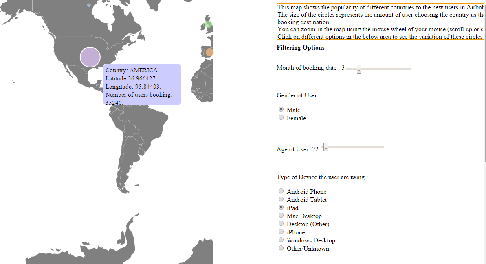
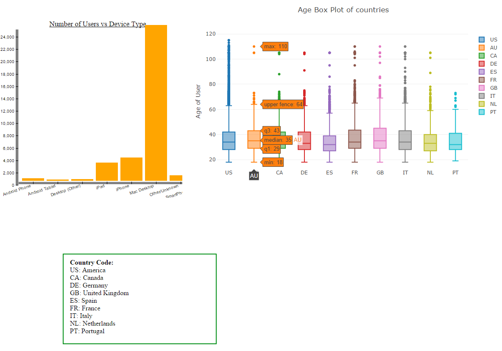

# AirbnbBookingsAnalysis
a web page that analyzes user booking data of Airbnb and shows insights on graphics 

 
User can interact with the graph by selecting filters on the right hand side. 

 

Compare data between different countries, divices, and genders  

